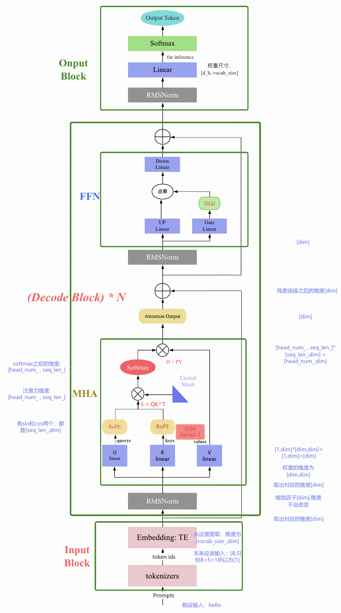
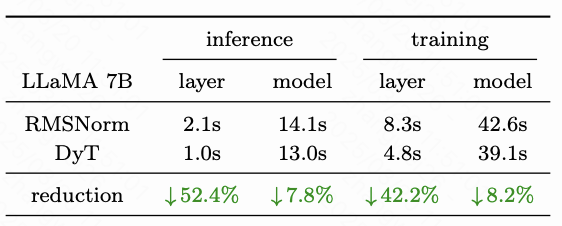

## llama1

论文地址：[LLaMA: Open and Efficient Foundation Language Models](https://link.zhihu.com/?target=https%3A//arxiv.org/pdf/2302.13971.pdf)

`LLaMA`（Large Language Model Meta AI）是 由 Meta AI 发布的一个开放且高效的大型基础语言模型，共有 `7B`、`13B`、`33B`、`65B`（650 亿）四种版本。其数据集来源都是公开数据集，无任何定制数据集，保证了其工作与开源兼容和可复现，整个训练数据集在 token 化之后大约包含 1.4T 的 token。

LLaMa 沿着**小 LLM 配大数据训练的指导思想**，训练了一系列性能强悍的语言模型，参数量从 7B 到 65B。例如，LLaMA-13B 比 GPT-3 小10倍，但是在大多数基准测试中都优于 GPT-3。较大点的 65B 的 LLaMa 模型也和 Chinchilla 或者 PaLM-540B 的性能相当。

**背景**

以 GPT-3 为代表的大语言模型 (Large language models, LLMs) 在海量文本集合上训练，展示出了惊人的涌现能力以及零样本迁移和少样本学习能力。GPT-3 把模型的量级缩放到了 175B，也使得后面的研究工作继续去放大语言模型的量级。在这个背景下，大家好像有一个共识，就是：模型参数量级的增加就会带来同样的性能提升。

Hoffmann 等人（2022）在论文 "Training Compute-Optimal Large Language Models" 提出了一种缩放定律（Scaling Law）：
“训练大语言模型时，在计算成本达到最优情况下，模型大小和训练数据 (token) 的数量应该比例相等地缩放，即：如果模型的大小加倍，那么训练数据的数量也应该加倍。”
这个定律告诉我们：给定特定的计算成本预算的前提下，语言模型的最佳性能不仅仅可以通过设计较大的模型搭配小一点的数据集得到，也可以通过设计较小的模型配合大量的数据集得到。

那么，相似成本训练 LLM，是大 LLM 配小数据训练，还是小 LLM 配大数据训练更好？
llama的作者认为 缩放定律在考虑计算成本时，只考虑了计算训练成本，而忽略了推理时的成本。llm模型训练并部署好之后，面对的是海量的推理请求，在这种情况下，我们首选的模型应该是推理最快的LLM，而不是训练最快的。因此对于上面的问题，llama的作者给出的答案是，LLM配大数据训练会更好，因为小LLM推理更友好。

### 1.1 LLaMA预训练数据

LLaMa 预训练数据大约包含 1.4T tokens，对于绝大部分的训练数据，在训练期间模型只见到过1次，Wikipedia 和 Books 这两个数据集见过2次。

| 数据集        | 样本比例 | Epochs | 磁盘大小 |
| ------------- | -------- | ------ | -------- |
| CommonCrawl   | 67.0%    | 1.10   | 3.3 TB   |
| C4            | 15.0%    | 1.06   | 783 GB   |
| Github        | 4.5%     | 0.64   | 328 GB   |
| Wikipedia     | 4.5%     | 2.45   | 83 GB    |
| Books         | 4.5%     | 2.23   | 85 GB    |
| ArXiv         | 2.5%     | 1.06   | 92 GB    |
| StackExchange | 2.0%     | 1.03   | 78 GB    |

English CommonCrawl [67%]：对五个 CommonCrawl 数据集进行预处理，时间跨度从2017年到2020年，使用 CCNet 流水线。该过程在行级别进行数据去重，使用 fastText 线性分类器进行语言识别，以删除非英语页面，并使用 n-gram 语言模型过滤低质量内容。此外，还训练了一个线性模型，用于将页面分类为 Wikipedia 中的引用页面与随机抽样页面，并丢弃未被分类为引用的页面。

C4 [15%]。C4的预处理还包括去重和语言识别步骤：与 CCNet 的主要区别在于质量过滤，这主要依赖于标点符号的存在或网页中的词语和句子数量等启发式方法。

Github [4.5%]。使用 Google BigQuery 上可用的公共 GitHub 数据集。只保留了在 Apache、BSD 和 MIT 许可下发布的项目。此外，使用基于行长度或字母数字字符比例的启发式方法过滤低质量文件，并使用正则表达式删除了诸如头文件之类的样板文件。最后，对生成的数据集进行了文件级别的去重，使用完全匹配的方法

Wikipedia [4.5%]。添加了截至2022年6月至8月的 Wikipedia 数据，涵盖20种语言。处理数据以去除超链接、评论和其他格式样板。

Gutenberg and Books3 [4.5%]。添加了两个书的数据集，分别是 Gutenberg 以及 ThePile (训练 LLM 的常用公开数据集) 中的 Book3 部分。处理数据时执行重复数据删除，删除内容重叠超过 90% 的书籍。

ArXiv [2.5%]。处理了arXiv Latex文件，以添加科学数据到数据集中。移除了第一节之前的所有内容，以及参考文献。还移除了.tex文件中的注释，并且内联展开了用户编写的定义和宏，以增加论文之间的一致性。

Stack Exchange [2%]。作者添加了 Stack Exchange，这是一个涵盖各种领域的高质量问题和答案网站，范围从计算机科学到化学。作者从 28 个最大的网站保留数据，从文本中删除 HTML 标签并按分数对答案进行排序

Tokenizer。使用字节对编码（BPE）算法对数据进行分词，使用 SentencePiece 的实现。值得注意的是，作者将所有数字分割成单个数字。

```python
import os
from logging import getLogger
from typing import List

from sentencepiece import SentencePieceProcessor

logger = getLogger()

class Tokenizer:
    def __init__(self, model_path: str):
        # reload tokenizer
        assert os.path.isfile(model_path), model_path
        self.sp_model = SentencePieceProcessor(model_file=model_path)
        logger.info(f"Reloaded SentencePiece model from {model_path}")

        # BOS / EOS token IDs
        self.n_words: int = self.sp_model.vocab_size()
        self.bos_id: int = self.sp_model.bos_id()
        self.eos_id: int = self.sp_model.eos_id()
        self.pad_id: int = self.sp_model.pad_id()
        logger.info(
            f"#words: {self.n_words} - BOS ID: {self.bos_id} - EOS ID: {self.eos_id}"
        )
        assert self.sp_model.vocab_size() == self.sp_model.get_piece_size()

    def encode(self, s: str, bos: bool, eos: bool) -> List[int]:
        assert type(s) is str
        t = self.sp_model.encode(s)
        if bos:
            t = [self.bos_id] + t
        if eos:
            t = t + [self.eos_id]
        return t

    def decode(self, t: List[int]) -> str:
        return self.sp_model.decode(t)
```

### 1.2 模型整体结构

和 `GPT` 系列一样，LLaMA 模型也是 `Decoder-only` 架构，但结合前人的工作做了一些改进，比如：

1. `Pre-normalization` [GPT3]. 为了提高训练稳定性，LLaMA 对每个 transformer 子层的输入进行归一化，使用 `RMSNorm` 归一化函数，Pre-normalization 由Zhang和Sennrich（2019）引入。使用 `RMSNorm` 的好处是不用计算样本的均值，速度提升了40%
2. `FFN_SWiGLU` [PaLM]。结构上使用门控线性单元，且为了保持 FFN 层总参数量不变，将隐藏单元的数量调整为 $\frac{2}{3}4d$ 而不是 PaLM 论文中的 4d，同时将 ReLU 替换为 `SiLU` [Shazeer,2020]激活，引入以提高性能。
3. `Rotary Embeddings` [GPTNeo]。模型的输入不再使用 `positional embeddings`，而是在网络的每一层添加了 positional embeddings (`RoPE`)，RoPE 方法由Su等人（2021）引入

完整的模型结构图如下图所示:

<center>

</center>

> [processon 在线浏览](https://www.processon.com/view/link/67163481a8011b320f2af67f?cid=67161b027f25232473eba8d3)

llama 模型系列的超参数详细信息在表 2 中给出。

<div align="center">

</div>

### 1.3 RMSNorm

**归一化层的作用简介：**

归一化层自2015年批量归一化（[Batch Normalization](https://zhida.zhihu.com/search?content_id=255090495&content_type=Article&match_order=1&q=Batch+Normalization&zhida_source=entity), BN）的提出以来，迅速成为现代神经网络的核心组件。它们不仅加速了模型的收敛，还提高了训练的稳定性。随着网络变得越来越深和宽，归一化层的作用变得愈发重要。

分析表明，LN层通过**将极端值“压缩”到较小的范围内**，使得模型能够更稳定地训练。这种非线性压缩效应被认为是归一化层的关键作用之一。

**归一化层分类：**

- Batch Norm(BN)：对于每个特征维度，计算它在整个批次中的均值和标准差，然后对该特征进行归一化。
- Layer Norm(LN)：对每个样本单独计算其所有特征的均值和标准差，然后在该样本内进行归一化。

`Batch norm` 和 `layer norm` 的区别一句话总结就是 `bn` 是切特征，`ln` 是切样本。

**LayerNorm**：

LayerNorm 通过对输入和权重矩进行重新中心化和重新缩放（`re-centering 和re-scaling`，即减均值和除方差，也称平移不变性和缩放不变性），来帮助稳定训练并加速模型收敛。

LayerNorm（LN） 主要用于 NLP 领域，它对每个 token 的特征向量进行归一化计算。设某个 token 的特征向量为 $x \in \mathbb{R}^d$，LN 运算如下：

$$
\text{LN}(x): \hat{x}_i =  \gamma \odot \frac{x_i - \hat{\mu}}{\hat{\sigma}} + \beta
$$

其中 $\odot$ 表示按位置乘，$\gamma, \beta \in \mathbb{R}^d$ 是缩放参数（scale）和偏移参数（shift），代表着把第 $i$ 个特征的 batch 分布的均值和方差移动到 $\beta^i, \gamma^i$。$\gamma$ 和 $\beta$ 是需要与其他模型参数一起学习的参数。 $\hat{\mu}$ 和 $\hat{\sigma}$ 表示特征向量所有元素的均值和方差，计算如下：

$$
\hat{\mu} = \frac{1}{d} \sum_{x_i \in \textrm{x}} x_i
$$

$$
\hat{\sigma} = \sqrt{\frac{1}{d} \sum_{x_i \in \textrm{x}} (x_i - \hat{\mu})^2 + \epsilon}
$$

注意我们在方差估计值中添加一个小的常量 $\epsilon$，以确保我们永远不会尝试除以零。

**RMSNorm**：

[RMSNorm](https://openreview.net/pdf?id=SygkZ3MTJE)（Root Mean Square Layer Normalization）论文假设 LayerNorm 中的重新中心化不再是必须的（平移不变性不重要），并提出了一种新的归一化方法：均方根层归一化（RMSNorm）。RMSNorm 通过均方根（RMS）对每一层神经元的输入进行归一化，使模型具备重新缩放不变性和隐式学习率调整的能力。相比 LayerNorm，RMSNorm 计算更为简洁，大约可以节省 7% 到 64% 的运算。

LayerNorm 和 RMSNorm 都主要用于 NLP 领域，它对每个 `token` 的**特征向量**（即嵌入维度）进行归一化计算。设某个 token 的特征向量为 $\textrm{x}\in \mathbb{R}$，RMSNorm 的计算如下：

$$
\text{RMSNorm}(x): \hat{x}_i = \gamma \odot \frac{x_i}{\text{RMS}(x)} \\
\text{RMS(x)} = \sqrt{\frac{1}{d} \sum_{x_i \in \textrm{x}} x_i^2 + \text{eps}}
$$

其中，$\gamma$ 是可学习的缩放参数，$\text{eps}$ 的作用是为了保持数值稳定性。$d$ 输入 `tokens` 的数量，大小为 `batch_size * seq_len`。

以下是 RMSNorm 在 PyTorch 中的简单实现，使用了 RMS（均方根）来对输入进行归一化处理。

```python
import torch
import torch.nn as nn

class LlamaRMSNorm(nn.Module):
    """nlp 领域"""
    def __init__(self, dim, eps=1e-6):
        """
        :param dim: 输入的维度
        """
        super(RMSNorm, self).__init__()
        self.scale = nn.Parameter(torch.ones(dim))  # 可学习的缩放参数
        self.variance_epsilon = eps
  
    def forward(self, hidden_states):
        # hidden_states 的形状为 [batch_size, seq_len, dim]
        input_dtype = hidden_states.dtype
        hidden_states = hidden_states.to(torch.float32)
        variance = torch.mean(x ** 2, dim=-1, keepdim=True)

        hidden_states = hidden_states * torch.rsqrt(variance + self.variance_epsilon)
        return self.weight * hidden_states.to(input_dtype)

# 测试 RMSNorm
batch_size, seq_len, dim = 2, 4, 8
x = torch.randn(batch_size, seq_len, dim)

rmsnorm = RMSNorm(dim)
output = rmsnorm(x)

# nn.RMSNorm 如果传入的是单个整数，则会将其视为一个单元素列表，
# 模块会对最后一个维度进行归一化，并且该维度的大小应该符合这个指定值。
rmsnorm_pytorch = nn.RMSNorm(dim)
output_pytorch = rmsnorm_pytorch(x)

print("输入和输出的形状: ", x.shape, output.shape)
if torch.allclose(output, output_pytorch, atol=1e-6):
    print("结果验证通过: 自己实现的RMSNorm 和 pytorch nn.RMSNorm 结果一致！")
else:
    print("结果验证失败: 自己实现的RMSNorm 和 pytorch nn.RMSNorm 结果不一致。")
```

代码运行后输出结果如下所示：

> 输入和输出的形状:  torch.Size([2, 4, 8]) torch.Size([2, 4, 8])
> 结果验证通过: 自己实现的 RMSNorm 和 pytorch nn.RMSNorm 结果一致！

**去归一化层新方向进展：**

[Transformers without Normalization](https://arxiv.org/abs/2503.10622) 研究者们通过对Transformer模型中的层归一化（[Layer Normalization](https://zhida.zhihu.com/search?content_id=255090495&content_type=Article&match_order=1&q=Layer+Normalization&zhida_source=entity), LN）进行深入分析，发现LN的输出与输入之间呈现出一种类似于tanh函数的S形曲线。基于这一观察，他们提出了 **动态Tanh（DyT）** ，一种简单的逐元素操作，能够在不计算激活统计量的情况下，模拟LN的行为。

通过实验，他们证明了使用DyT的Transformer模型在多种任务中表现优异，甚至在某些情况下超越了传统的归一化模型。

DyT比[RMSNorm](https://zhida.zhihu.com/search?content_id=255076288&content_type=Article&match_order=1&q=RMSNorm&zhida_source=entity)在H100s上更快，实验数据如下：

<div align="center">

</div>

这项研究的意义就在于，鉴于模型训练和推理可能需要数千万次的计算，因此DyT有极大潜力帮助降低成本，接下来就是找到应用。

动态Tanh (DyT）的代码实现如下：

```python
class DyT(nn.Module):
    def __init__(self, num_features, alpha_init_value=0.5):
        super().__init__()
        self.alpha = nn.Parameter(torch.ones(1) * alpha_init_value)
        self.weight = nn.Parameter(torch.ones(num_features))
        self.bias = nn.Parameter(torch.zeros(num_features))


    def forward(self, x):
        x = torch.tanh(self.alpha * x)
        return x * self.weight + self.bias
```

### 1.4 FFN_SwiGLU

#### FFN 发展史

**FFN**:

`FFN` 层全称是 Position-wise Feed-Forward Networks（`FFN`），`FFN` 接收一个张量 x（序列中特定位置的隐藏表示），并将其通过两个可学习的**线性变换**（由矩阵 W1 和 W2 以及偏置向量 b1 和 b2 表示）进行处理，在两个线性变换之间应用修正线性（`ReLU`）[Glorot et al.,2011](https://proceedings.mlr.press/v15/glorot11a/glorot11a.pdf)激活。FFN 层结构如下图所示:

<center>

</center>

`FFN` 计算过程用数学公式可表达为：

$$
\text{FFN}(x, W_1, W_2, b_1, b_2) = \text{max}(0, xW_1 + b_1 )W_2 + b_2
$$

在 T5 模型的实现中，使用的是没有偏置 `bias` 的版本，数学公式表达如下:

$$
\text{FFN}(x, W_1, W_2) = \text{max}(0, xW_1)W_2
$$

**$\text{Swish}$ 激活**:
后续的研究提出了用其他非线性激活函数替换 ReLU，如高斯误差线性单元 （Gaussian Error Linear Units），$\text{GELU}(x) = x\Phi (x)$ 和自门控(Self-Gated)激活函数 $\text{Swish}_{\beta}(x) = x\sigma(\beta x)$ [Ramachandran et al., 2017](https://arxiv.org/pdf/1710.05941)，其中 $\sigma$ 为 $\text{Sigmoid}$ 激活函数。

$$
\text{FFN}_{\text{GELU}}(x, W_1, W_2) = \text{GELU}(xW_1)W_2 \\
\text{FFN}_{\text{Swish}}(x, W_1, W_2) = \text{Swish}(xW_1)W_2
$$

其中激活函数 $\text{Swish}(x) = x⋅ \text{Sigmoid}(\beta x) = \frac{x}{1 + e^{-\beta x}}$，Sigmoid 函数: $\sigma(x) = \frac{1}{1 + e^{-x}}$。

$\beta$ 可以是常数或可训练参数。下图展示了不同 $\beta$ 值下的 Swish 曲线。

1. 如果 $\beta$ = 1，Swish 等价于 Elfwing 等人（2017）为强化学习提出的 Sigmoid 加权线性单元（`SiLU`）。
2. 当 $\beta = 0$ 时，Swish 变为缩放线性函数 $f(x) = x/2$。
3. 随着 $\beta$ 趋近于无穷大，sigmoid 分量接近 0-1 函数，因此 Swish 变得与 ReLU 函数相似。这表明 Swish 可以被看作是一个平滑的函数，在线性函数和 ReLU 之间进行非线性插值。如果将 $\beta$ 设置为可训练参数，模型可以调控这种插值的程度。

<center>

</center>

**门控线性单元 GLU**:
[Dauphin et al., 2016](https://arxiv.org/pdf/1612.08083) 提出了**门控线性单元**（ Gated Linear Units, `GLU`），定义为输入的两个线性变换的**逐元素乘积**，其中一个经过了 sigmoid 激活。另外，他们还建议省略激活函数，称之为“双线性”（bilinear）层。

$$
\text{GLU}(x, W, V, b, c) = \sigma(xW+b)\otimes (xV+c) \\
\text{bilinear}(x, W, V, b, c) = (xW+b)\otimes (xV+c)
$$

当然，也使用其他激活函数定义 **GLU 变体**，如下所示:

$$
\text{ReGLU}(x, W, V,b, c) = \text{max}(0, xW+b)\otimes (xV+c) \\
\text{GEGLU}(x, W, V,b, c) = \text{GELU}(xW+b)\otimes (xV+c) \\
\text{SwiGLU}(x, W, V,b, c) = \text{Swish}(xW+b)\otimes (xV+c)
$$

**FFN 变体之 $\text{FFN}_\text{SwiGLU}$**:

基于门控线性单元 $\text{GLU}$ 和 $\text{Swish}$ 激活，Noam Shazeer 发表了论文[GLU Variants Improve Transformer, 2020](https://arxiv.org/pdf/2002.05202.pdf)，论文中提出了很多 Transformer FFN 层的变体，这些变体用 GLU 或其变体之一来替代原来的第一层线性变换和激活函数，和 FFN 一样，也省略了偏置项，这些 FFN 变体数学表达式如下所示:


#### FFN_SwiGLU

`llama` 对 FFN 的改进结构-$\text{FFN}_{\text{SwiGLU}}$，正是来源于论文：GLU Variants Improve Transformer。和 `FFN_SwiGLU` 原版实现使用 `Swish` 稍有不同，LLaMA 官方提供的代码使用 `F.silu()` 激活函数，$\text{SiLU}(x) = x⋅ \text{Sigmoid}(x)$。`SwiGLU` 数学表达式如下:

$$
\text{FFN}_{\text{SwiGLU}}(x, W_1, W_3, W_2) = (\text{SiLU}(xW_1)\otimes xW_3)W_2
$$

$\text{FFN}_{\text{SwiGLU}}$ 层结构如下图所示:

<center>

</center>

原始的的 $\text{FFN}$ 层只有两个权重矩阵，但变体 $\text{FFN}_{\text{SwiGLU}}$ **有三个线性层权重矩阵**：$W_1$、$W_3$、$W_2$。为了保持参数数量和计算量的恒定，需要将隐藏单元的数量 `d_ff`（权重矩阵 $W_1$ 和 $W_3$ 的第二个维度以及 $W_2$ 的第一个维度）缩小 `2/3`。

`Pytorch` 实现代码如下所示:

```python
# -*- coding  : utf-8 -*-

import torch
import torch.nn as nn
import torch.nn.functional as F

class FFNSwiGLU(nn.Module):
    def __init__(self, input_dim: int, hidden_dim: int):
        super().__init__()
        hidden_dim = int(2 * hidden_dim / 3)
        self.fc1 = nn.Linear(input_dim, hidden_dim, bias=False)
        self.fc2 = nn.Linear(hidden_dim, input_dim, bias=False)
        self.fc3 = nn.Linear(input_dim, hidden_dim, bias=False)

    def forward(self, x):
        # LLaMA 官方提供的代码是使用 F.silu() 激活函数
        return self.fc2(F.silu(self.fc1(x)) * self.fc3(x))

layer = FFNSwiGLU(128, 256)
x = torch.randn(1, 128)
out = layer(x)
print(out.shape) # torch.Size([1, 128])
```

### 1.5 RoPE 旋转位置编码

Llama 在对序列进行位置编码时，与标准Transformer不一样，Llama 的位置编码在每个Attention层中分别对Q 和 K 进行[RoPE位置编码](https://link.zhihu.com/?target=https%3A//arxiv.org/pdf/2104.09864.pdf)，而不是在Transformer Block之前进行一次位置编码，也就是说每次计算Attention时都分别要对Q 和 K做位置编码。

`RoPE`（Rotary Position Embedding）旋转位置编码，由模型 [RoFormer: Enhanced Transformer with Rotary Position Embedding](https://arxiv.org/pdf/2104.09864v5) 提出。RoPE 的核心思想是将位置编码与词向量通过旋转矩阵相乘，使得词向量不仅包含词汇的语义信息，还融入了位置信息，其具有以下优点：

1. 相对位置感知：RoPE 能够自然地捕捉词汇之间的相对位置关系。
2. 无需额外的计算：位置编码与词向量的结合在计算上是高效的。
3. 适应不同长度的序列：RoPE 可以灵活处理不同长度的输入序列。

**结合 RoPE 的 self-attention 操作的流程**如下：

1. 首先，对于 `token` 序列中的每个词嵌入向量，都计算其对应的 query 和 key 向量;
2. 然后在得到 query 和 key 向量的基础上，应用公式（7）和（8）对每个 `token` 位置都计算对应的旋转位置编码；
3. 接着对每个 `token` 位置的 query 和 key 向量的元素按照**两两一组**应用旋转变换；
4. 最后再计算 `query` 和 `key` 之间的内积得到 self-attention 的计算结果。

#### RoPE 代码实现

最后，如果你直接看 `pytorch` 代码，其实很难理解 `rope` 是如何应用相对位置信息的，这个只能通过前面的公式推导才能理解。

结合 llama 官方实现代码，下述是经过修改优化和添加注释后的代码，更容易看懂:

```python
def compute_theta(dim: int, base: float = 10000.0, device: torch.device = torch.device('cpu')) -> torch.Tensor:
    """
    计算旋转位置编码中的 Theta 角度值。

    参数：
    - d (int): 嵌入向量的维度（必须为偶数）。
    - base (float): 基础频率参数, 默认为10000.0。
    - device (torch.device): 计算设备, 默认为CPU。

    返回：
    - torch.Tensor: 包含Theta值的1D张量, 形状为 [d/2]。
    """
    if dim % 2 != 0:
        print("嵌入维度 dim 必须为偶数")
    i = torch.arange(1, (dim//2) + 1, dtype=torch.float32, device=device)
    theta_i = base ** (-2*(i - 1) / dim)

    return theta_i

def precompute_freqs_cis(dim: int, seq_len: int, base: float = 10000.0, device: torch.device = torch.device('cpu')):
    theta = compute_theta(dim, base, device) # theta 角度值序列，向量, 大小为 dim // 2
    m = torch.arange(seq_len, device=device) # # token 位置值序列，向量，大小为 seq_len
    m_theta = torch.outer(m, theta) # 所有 token 位置的所有 Theta 值范围, 矩阵，尺寸为 [seq_len, dim // 2]
    freqs_cis = torch.polar(torch.ones_like(m_theta), m_theta) # e^{i*m*\theta}，本质上是旋转矩阵
    return freqs_cis

def reshape_for_broadcast(freqs_cis, x):
    ndim = x.ndim
    assert ndim >= 2
    assert freqs_cis.shape == (x.shape[1],x.shape[-1]), "the last two dimension of freqs_cis, x must match"
    shape = [d if i==1 or i==ndim-1 else 1 for i,d in enumerate(x.shape)]
    return freqs_cis.view(*shape)

def apply_rotary_emb(xq: torch.Tensor, xk: torch.Tensor, freqs_cis: torch.Tensor, device: torch.device = torch.device('cpu')):
    """
    参数:
        - x_q(torch.Tensor): 实际上是权重 W_q * 词嵌入向量值, 来自上一个线性层的输出, 形状为 [batch_size, seq_len, n_heads, head_dim]
        - x_k(torch.Tensor): 实际上是权重 W_k * 词嵌入向量值, 来自上一个线性层的输出, 形状为 [batch_size, seq_len, n_heads, head_dim]
        - freqs_cis (torch.Tensor): 频率复数张量, 形状为 [max_seq_len, head_dim]
    返回:
        - Tuple[torch.Tensor, torch.Tensor]: 旋转编码后的查询和键张量
    """
    # 实数域张量转为复数域张量
    xq_reshape = xq.reshape(*xq.shape[:-1], -1, 2) # [batch_size, seq_len, dim] -> [batch_size, seq_len, dim//2, 2] 
    xk_reshape = xk.reshape(*xk.shape[:-1], -1, 2) # [batch_size, seq_len, dim] -> [batch_size, seq_len, dim//2, 2] 
    xq_complex = torch.view_as_complex(xq_reshape) # 复数形式张量
    xk_complex = torch.view_as_complex(xk_reshape) # 复数形式张量

    # 旋转矩阵（freqs_cis）的维度在序列长度（seq_len，维度 1）和头部维度（head_dim，维度 3）上需要与嵌入的维度一致。
    # 此外，freqs_cis 的形状必须与 xq 和 xk 相匹配，因此我们需要将 freqs_cis 的形状从 [max_seq_len, head_dim] 调整为 [1, max_seq_len, 1, head_dim]。
    freqs_cis = reshape_for_broadcast(freqs_cis, xq_complex) # [max_seq_len, 1, 1, dim // 2]

    # 应用旋转操作，并将结果转回实数域
    xq_out = torch.view_as_real(xq_complex * freqs_cis).flatten(3) # flatten(2) 将后面两个维度压成一个维度
    xk_out = torch.view_as_real(xk_complex * freqs_cis).flatten(3)

    return xq_out.type_as(xq), xk_out.type_as(xk)
```

### 1.6 基于开源 LLaMA 1 微调的模型

> 以下这些项目都可以算是 Meta 发布的 LLaMA（驼马）模型的子子孙孙。

**1，Alpaca**

[Alpaca](https://github.com/tatsu-lab/stanford_alpaca) 是斯坦福在 `LLaMA` 上对 52000 条指令跟随演示进行了精细调优的模型，是后续很多中文 LLM 的基础。

对应的中文版是 [Chinese-LLaMA-Alpaca](https://github.com/ymcui/Chinese-LLaMA-Alpaca/)。该项目在原版 LLaMA 的基础上**扩充了中文词表**并使用了中文数据进行**二次预训练**，进一步提升了中文基础语义理解能力。同时，在中文LLaMA 的基础上，本项目使用了**中文指令数据进行指令精调**，显著提升了模型对指令的理解和执行能力。

值得注意的是，该项目开源的不是完整模型而是 `LoRA` 权重，理解为原 LLaMA 模型上的一个“补丁”，两者进行合并即可获得完整版权重。提醒：仓库中的中文 LLaMA/Alpaca LoRA 模型无法单独使用，需要搭配原版 LLaMA 模型[1]。可以参考本项目给出的[合并模型步骤](https://github.com/ymcui/Chinese-LLaMA-Alpaca/blob/main/README.md#%E5%90%88%E5%B9%B6%E6%A8%A1%E5%9E%8B)重构模型。

- repo: https://github.com/ymcui/Chinese-LLaMA-Alpaca/

**2，Vicuna**

[Vicuna](https://chat.lmsys.org/) 是一款从 LLaMA 模型中对用户分享的对话进行了精细调优的聊天助手，根据评估，这款聊天助手在 LLaMA 子孙模型中表现最佳，能达到  ChatGPT 90% 的效果。

<div align="center">

</div>

**3，Koala（考拉）**

一款从 `LLaMA` 模型中对用户分享的对话和开源数据集进行了**精细调优**的聊天机器人，其表现与 `Vicuna` 类似。

- blog: Koala: A Dialogue Model for Academic Research
- demo: FastChat
- repo: https://github.com/young-geng/EasyLM

**4，Baize (白泽)**

- 论文：https://arxiv.org/pdf/2304.01196.pdf
- demo: Baize Lora 7B - a Hugging Face Space by project-baize
- repo: https://github.com/project-baize/baize

**5，Luotuo (骆驼，Chinese)**

- repo: https://github.com/LC1332/Luotuo-Chinese-LLM

另外，中文 LLM 的有影响力的模型还有 `ChatGLM`，通常指 `ChatGLM-6B`， 一个由清华团队开源的、支持中英双语的对话语言模型，基于 [General Language Model (GLM)](https://github.com/THUDM/GLM) 架构，具有 62 亿参数。结合模型量化技术，用户可以在消费级的显卡上进行本地部署 ChatGLM（INT4 量化级别下最低只需 6GB 显存）。

整体使用下来，其基本任务没问题，但是涌现能力还是有限的，且会有事实性/数学逻辑错误，另外，Close QA 问题也很一般。`GLM` 模型架构与 BERT、T5 等预训练模型模型架构不同，它采用了一种**自回归**的空白填充方法,。

## 二 llama2 模型

### 2.1 llama2 概述

llama2 相比于 llama1 其训练数据提升了 40%，有 7B、13B、34B、70B 四个大小，其中 34B 的没有开放，另外三个都可下载。llama2 总共使用 2T 的 token 进行训练，上下文长度升级到了 4096，是 llama1 的两倍。从其 model card 中可知，llama2 的预训练是在 A100-80GB 上运行了 3.3M GPU hours。

和 LLaMA1 对比，Tokenizer 配置与 llama1 完全相同，分词使用 sentencePiece 库实现的 `BPE` 算法，vocabulary size 为 32k。

**llama2 模型架构和 llama1 一模一样，但模型推理的 `decode` 阶段的 kv cache 优化上做了改变**。具体来说，在 llama2-34B 和 llama2-70B 参数模型上使用了 `GQA` 优化技术，7B 和 13B 模型依然使用 `MQA`。

> kv cache 内存计算公式为：$\text{memory\_kv-cache} = 2*2*nh*b(s+o) = 4nh*b(s+o)$。

### 2.2 kv cache 优化-GQA

`MQA`，全称 Multi Query Attention, `GQA` 由 google 提出的 MQA 变种，全称 Group-Query Attention，都是多头注意力（MHA）的变体，本质上是一种**共用 KV cache 的优化方法**。

kv cache 优化三种方案：`MHA`、 `MQA` 和 `GQA` 的原理及区别如下：

1. 最原始的 MHA(Multi-Head Attention)，QKV 三部分有相同数量的头（head），且一一对应。每次做 Attention，head1 的 QKV 就做好自己运算就可以，最后输出时将各个头的 `self-attention output` 相拼接。
2. MQA 则是让 Q 仍然保持原来的头数，但 K 和 V 只有一个头，相当于所有的 Q 头共享一个 K 和 V 头，所以叫做 Multi-Query 了。这直接让 KV cache 内存减少了 head_num 倍。
3. `GQA` 是 `MHA` 和 `MQA` 的折中，将 Q 分成 8 组，每组共享相同的一个 kv 头，假设 Q 有 64 个头，则使用 `GQA` 技术后，kv 头数 = $64/8 = 8$。这直接让 KV cache 内存减少了 8 倍。

LLaMA2-70b 的模型配置如下图所示：

<center>

</center>

`MHA`、 `MQA` 和 `GQA` 原理的可视化对比如下图所示:

<center>

</center>

LLaMA2 官方实现的 `GQA`（包含了 kv cahce）代码如下所示（经过简化）：

```python
def repeat_kv(x: torch.Tensor, n_rep: int) -> torch.Tensor:
    """torch.repeat_interleave(x, dim=2, repeats=n_rep)"""
    bs, slen, n_kv_heads, head_dim = x.shape
    # 根据n_rep，拓展KV
    if n_rep == 1:
        return x
    return (x[:, :, :, None, :].expand(bs, slen, n_kv_heads, n_rep, head_dim).reshape(bs, slen, n_kv_heads * n_rep, head_dim))
  
class Attention(nn.Module):
    def __init__(self, args: ModelArgs):
        super().__init__()
        ...
        self.n_local_heads = args.n_heads // model_parallel_size #Q的头数
        self.n_local_kv_heads = self.n_kv_heads // model_parallel_size  #KV的头数
        self.n_rep = self.n_local_heads // self.n_local_kv_heads 
        ...
        self.wq = ColumnParallelLinear(args.dim,args.n_heads * self.head_dim, # Q的头数* head_dim
                                       ...)
        self.wk = ColumnParallelLinear(args.dim,self.n_kv_heads * self.head_dim, # K的头数* head_dim
                                       ...)
        self.wv = ColumnParallelLinear(args.dim,self.n_kv_heads * self.head_dim,# V的头数* head_dim
                                       ...)
        self.wo = RowParallelLinear(args.n_heads * self.head_dim,args.dim,... )

        self.cache_k = torch.zeros((args.max_batch_size,args.max_seq_len,self.n_local_kv_heads, #KV的头数
                self.head_dim,)).cuda()
        self.cache_v = torch.zeros((args.max_batch_size,args.max_seq_len,self.n_local_kv_heads,#KV的头数   
                                    self.head_dim,)).cuda()
    def forward(
        self,
        x: torch.Tensor,
        start_pos: int,
        freqs_cis: torch.Tensor,
        mask: Optional[torch.Tensor],
    ):
        bsz, seqlen, _ = x.shape
        xq, xk, xv = self.wq(x), self.wk(x), self.wv(x)

        xq = xq.view(bsz, seqlen, self.n_local_heads, self.head_dim)
        xk = xk.view(bsz, seqlen, self.n_local_kv_heads, self.head_dim)
        xv = xv.view(bsz, seqlen, self.n_local_kv_heads, self.head_dim)
  
        xq, xk = apply_rotary_emb(xq, xk, freqs_cis=freqs_cis) #嵌入RoPE位置编码
        ...
        # 按此时序列的句子长度把kv添加到cache中
        # 初始在prompt阶段seqlen>=1, 后续生成过程中seqlen==1
        self.cache_k[:bsz, start_pos : start_pos + seqlen] = xk
        self.cache_v[:bsz, start_pos : start_pos + seqlen] = xv
        # 读取新进来的token所计算得到的k和v
        keys = self.cache_k[:bsz, : start_pos + seqlen]
        values = self.cache_v[:bsz, : start_pos + seqlen]

        # repeat k/v heads if n_kv_heads < n_heads
        keys = repeat_kv(keys, self.n_rep)  # (bs, seqlen, n_local_heads, head_dim)
        values = repeat_kv(values, self.n_rep)  # (bs, seqlen, n_local_heads, head_dim)
   
        xq = xq.transpose(1, 2)  # (bs, n_local_heads, seqlen, head_dim)
        keys = keys.transpose(1, 2)
        values = values.transpose(1, 2)
        #计算q*k
        scores = torch.matmul(xq, keys.transpose(2, 3)) / math.sqrt(self.head_dim)
        if mask is not None:
            #加入mask，使得前面的token在于后面的token计算attention时得分为0，mask掉
            scores = scores + mask  # (bs, n_local_heads, seqlen, cache_len + seqlen)
        scores = F.softmax(scores.float(), dim=-1).type_as(xq)
        output = torch.matmul(scores, values)  # (bs, n_local_heads, seqlen, head_dim)
        output = output.transpose(1, 2).contiguous().view(bsz, seqlen, -1)
        return self.wo(output)
```

## 三 llama3 模型

**和 Llama 2 相比，Llama 3 最大的变化是采用了新的 Tokenizer**，将词汇表大小扩展至 128k（前版本为 32k Token）。

### 3.1 llam3 概述

llama3 技术推理角度的总结：

1. **模型结构**: Llama 3 中依然选择了相对标准的纯解码器 decoder-only transformer 架构，模型结构上和 Llama 2 相比几乎没变化。在 Llama 2 中只有 34B,70B 使用了分组查询注意 (GQA)，为了提高模型的推理效率，**Llama 3 所有模型都采用了 `GQA`**。
2. **分词器**：和 Llama 2 不同的是，Llama 3 将 tokenizer 由sentence piece 换成 `tiktoken`, 词汇量从 `32K` 增加到 `128K`，增加了 4 倍。更大的词汇库能够更高效地编码文本，增加编码效率，可以实现更好的下游性能。不过这也会导致**嵌入层**的输入和输出矩阵尺寸增大，模型参数量也会增大。
3. **序列长度**：在长度为 `8,192` 的 token 序列上训练（之前是 4K），即模型输入上下文长度从 `4096`（Llama 2）和 `2048`（Llama 1）增加到 `8192`（8k），但相对于 GPT-4 的 128K 来说还是相当小。

### 3.2 llam3.1 概述

首次发布了 `405B` 模型，和当下最强的 GPT-4 / Claude 3.5 旗鼓相当。全新升级了 Llama-3 的 8B 和 70B 版本，升级版不仅支持多语言功能，而且**其上下文长度延展到了 128K**，具有最先进的工具使用能力，推理能力也显著提升。

> llam3.1 系列模型于 2024 年 7 月发布，有 3 个可用版本：8B、70B、405B。

### 3.3 llam3.2 概述

2024 年 9 月又发布了 Llama 3.2，包括小型和中型视觉语言模型（11B 和 90B），以及轻量级的文本模型（1B 和 3B），这些模型可以在边缘设备和移动设备上运行，同时提供预训练和指令调优的版本。

1. **Llama 3.2 中的 1B 和 3B 模型支持 128K tokens 的上下文长度**，并且是同类中性能领先的，用于设备端的摘要生成、指令执行和文本重写任务。这些模型在发布时就已适配 Qualcomm 和 MediaTek 的硬件，并针对 Arm 处理器进行了优化。
2. 在视觉任务上，Llama 3.2 的 11B 和 90B 模型在图像理解方面优于封闭模型如 Claude 3 Haiku，可以直接作为对应文本模型的替代品。这些模型既有预训练版本，也有对齐版本，可以使用 torchtune 微调，并通过 torchchat 部署到本地。此外，用户还可以通过我们的智能助手 Meta AI 直接试用这些模型。
3. 首次发布了 Llama Stack 分发版本，这将大大简化开发者在不同环境中使用 Llama 模型的流程，包括单节点部署、本地部署、云端部署，以及设备端部署，从而实现 RAG（检索增强生成）和工具集成应用的快速部署。

#### 轻量级模型 1B 和 3B

在 Llama 3.1 中已经讨论过，借助强大的教师模型可以打造更小、更高效的模型。META 在 1B 和 3B 模型上采用了**剪枝和知识蒸馏**这两种技术，使得这些模型成为了首批适用于设备的高性能轻量级 Llama 模型。

通过剪枝技术，我们能够减小 Llama 系列现有模型的规模，同时尽可能多地保留其知识和性能。对于 1B 和 3B 模型，我们使用了从 Llama 3.1 8B 进行**一次性结构化剪枝的方法**，即系统性地移除网络中的部分组件，并调整权重和梯度大小，最终生成一个更小巧且高效的模型，但仍保留了原始模型的性能表现。

知识蒸馏通过让小模型从大模型中学习，使小模型在训练时能够获得更好的性能表现。对于 Llama 3.2 的 1B 和 3B 模型，我们在预训练阶段引入了 Llama 3.1 8B 和 70B 模型的**对数几率**（logits），并将这些较大模型的输出作为训练目标。在剪枝后，使用知识蒸馏技术进一步恢复模型的性能。

在**后训练阶段**（post-training），我们沿用了 Llama 3.1 的训练方案，通过多轮的对齐步骤生成最终的聊天模型。每一轮的对齐包括监督微调（SFT）、拒绝采样（RS）和直接偏好优化（DPO）。在这个阶段，我们将模型的上下文长度扩展到了 128K tokens，同时确保模型的质量与预训练模型保持一致。此外，我们还使用合成数据进行训练，经过严格的数据处理和筛选，以确保数据质量。我们通过精心组合这些数据，优化了模型在摘要生成、文本重写、指令执行、语言推理以及工具使用等方面的能力。

Llama 3.2 发布的模型权重采用 `BFloat16` 数字格式。

## 微调方法

在预训练后使用了有监督微调（SFT）、拒绝采样、近端策略优化（PPO）和直接策略优化（DPO）的组合微调算法。 SFT 中使用的提示（Prompt）质量、PPO 和 DPO 中使用的偏好排名对对齐（Align）模型的性能有巨大影响。

## 参考资料

1. [Hendrycks and Gimpel, 2016](https://arxiv.org/pdf/1606.08415.pdf)
2. [GLU Variants Improve Transformer](https://arxiv.org/pdf/2002.05202.pdf)
3. [llama2介绍(模型结构+参数计算)](https://zhuanlan.zhihu.com/p/647862867)
4. [知乎-Llama 2详解](https://zhuanlan.zhihu.com/p/649756898)
5. [详解三种常用标准化 Batch Norm &amp; Layer Norm &amp; RMSNorm](https://blog.csdn.net/wxc971231/article/details/139925707)
6. [open-llm-components](https://github.com/jeff52415/open-llm-components/tree/main)
7. [Build Your Own Llama 3 Architecture from Scratch Using PyTorch](https://pub.towardsai.net/build-your-own-llama-3-architecture-from-scratch-using-pytorch-2ce1ecaa901c)
8. [LLaMA: Open and Efficient Foundation Language Models](https://arxiv.org/pdf/2302.13971)
9. [Llama 2: Open Foundation and Fine-Tuned Chat Models](https://arxiv.org/pdf/2307.09288)
10. https://github.com/meta-llama/llama/blob/main/llama/model.py
